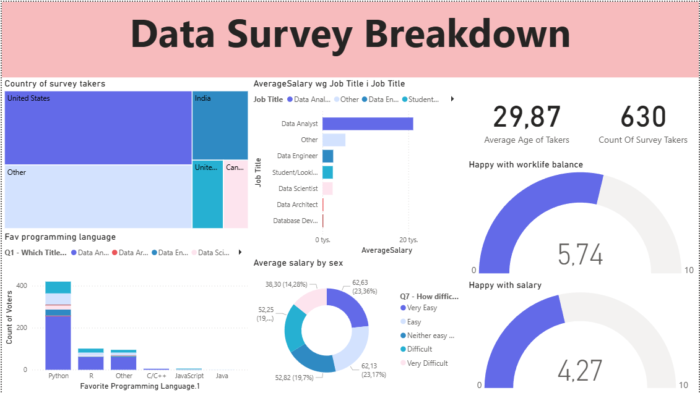

#  Data Professional Survey Breakdown (Power BI)

## Project Overview
This project involves an interactive Power BI dashboard analyzing the job market for data professionals. The goal was to visualize survey data to understand trends regarding **salaries, work-life balance, preferred programming languages, and job satisfaction** across different roles (Data Analysts, Data Scientists, Data Engineers, etc.).

*(Note: This project was built as part of a portfolio guided project by Alex The Analyst, focusing on end-to-end BI development).*

## ️ Dashboard Preview
Below is the main view of the report, allowing users to filter data by job title and location.

## Key Insights & Analysis
* **Salary Trends:** Analyzed average salaries broken down by job title, gender, and experience level.
* **Programming Languages:** Visualized the popularity of Python vs. R and other tools among professionals.
* **Work-Life Balance:** Assessed average satisfaction ratings and work-life balance scores across different roles.
* **Entry Barriers:** Examined the perceived difficulty of breaking into the data field.

## Technical Steps Taken
1.  **Data Extraction:** Imported raw survey data from a CSV file (`Power BI - Final Project.xlsx - Data Professional Survey.csv`).
2.  **Data Cleaning (Power Query):**
    * Removed duplicates and handled missing values.
    * Split complex columns (e.g., "Language" column) to count individual programming languages.
    * Standardized job titles for consistent grouping.
3.  **Data Modeling:** Created measures and calculated columns using **DAX** (e.g., Average Salary, Count of Respondents).
4.  **Visualization:** Designed an interactive dashboard using Cards, Bar Charts, Donut Charts, and Treemaps.

## Files in this Repository
* `Data Professional Survey.pbix` - The Power BI project file.
* `Power BI - Final Project.xlsx - Data Professional Survey.csv` - The raw dataset used for analysis.

